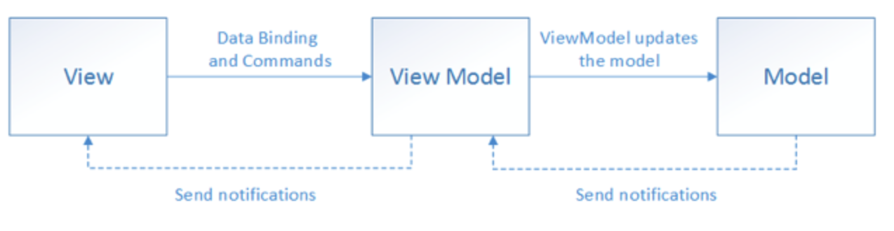

# mvc 패턴
mvc 패턴은 모델(Model), 뷰(View), 컨트롤러(Controller)로 이루어진 디자인 패턴입니다. 애플리케이션의 구성 요소를 세 가지 역할로 구분하여 개발 프로세스에서 각각의 구성 요소에만 집중해서 개발할 수 있습니다. 재사용성과 확장성이 용이하다는 장점이 있다. 하지만 애플리케이션이 복잡해질수록 모델과 뷰의 관계가 복잡해지는 단점이 있습니다.

 
  
### 모델(Model)
***
모델은 애플리케이션의 데이터인 데이터베이스, 상수, 변수등을 뜻합니다. 내부 데이터의 내용, 위치, 포멧에 관한 정보를 모두 가지고 있어야 합니다. 뷰에서 데이터를 생성하거나 수정하면 컨트롤러를 통해 모델을 생성하거나 갱신합니다.

### 뷰(View)
***
뷰는 inputbox, checkbox, textarea 등 사용자 인터페이스 요소를 나타냅니다. 모델을 기반으로 사용자가 볼 수 있는 화면을 뜻합니다. 모델이 가지고 있는 정보를 따로 저장하지 않아야 하며, 사각형 모양 등 화면에 표시하느 정보만 가지고 있어야 합니다. 변경이 일어나면 컨트롤러에 전달해야 합니다.

### 컨트롤러(Controller)
***
컨트롤러는 하나 이상의 모델과 하나 이상의 뷰를 잇는 다리 역할을 하며 이벤트 등 메인 로직을 담당합니다. 모델과 뷰의 생명주기도 관리합니다. 모델이나 뷰의 변경 통지를 받으면 이를 해석하여 각각의 구성 요소에 해당 내용에 대해 알려줍니다.

#### MVC패턴의 예 리액트

MVC 패턴을 이용한 대표적인 라이브러리로는 리액트(React.js)가 있습니다. 리액트는 유저 인터페이스를 구축하기 위한 라이브러리입니다. 대표적인 특성으로는 불변성(immutable)이 있습니다. 
  
# MVP 패턴
MVP 패턴은 MVC 패턴으로부터 파생되었으며, MVC에 해당하는 C에 해당하는 컨트롤러가 프레젠터로 교체된 패턴입니다. 뷰와 프레젠터는 일대일 관계이기 때문에 MVC 패턴 보다 더 강한 결합을 지닌 디자인 패턴입니다.
  

  
# MVVM 패턴
MVVM 패턴은 MVC의 C에 해당하는 컨트롤러가 뷰모델(view model)로 바뀐 패턴입니다. 여기서 뷰모델은 뷰를 더 추상화한 계층이며 MVC 패턴과 다르게 커맨드와 데이터 바인딩을 가지는 것이 특징입니다. 뷰와 뷰모델 사이에 양방향 데이터 바인딩을 지원합니다. UI를 별도의 코드 수정없이 재사용할 수 있고, 단위 테스팅하기 쉽다는 장점이 있습니다.

커맨드 : 여러개의 요소를 한번에 처리하는 기술
 
데이터 바인딩 : 화면 데이터와 웹 브라우저의 메모리 데이터를 일치 시키는 기법(뷰모델 변경시 -> 뷰 변경)

### MVVM 패턴의 예 : 뷰
***
Vue.js는 반응형이 특징인 프런트엔드 프레임워크입니다. 함수를 사용하지 않고 값 대입만으로도 변수가 변경되어 양방향 바인딩, html을 토대로 컴포넌트를 구축할 수 있다는 장점이 있습니다. 