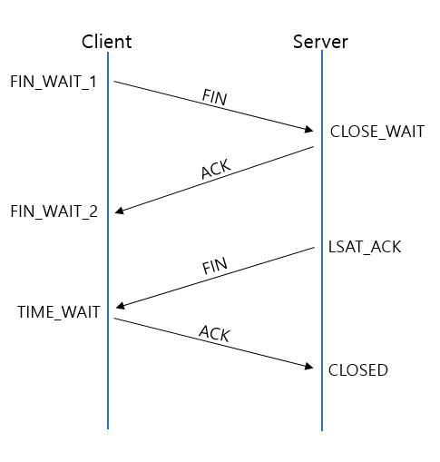

# TCP/IP 4계층 모델
인터넷 프로토콜 스위트는 인터넷에서 컴퓨터들이 서로 정보를 주고받는 데 쓰이는 프로토콜의 집합이다.

### 계층 구조
***
TCP/IP 계층은 네 개의 계층을 가지고 있으며 OSI 7 계층과 많이 비교합니다.
* 애플리케이션 계층 : FTP, HTTP, SSH, SMTP, DNS 등 응용 프로그램이 사용되는 프로토콜 계층이며 웹 서비스, 이메일 서비스를 실질적으로 사람들에게 제공하는 층입니다.
> FTP : 장치와 장치 간의 파일을 전송하는 데 사용되는 표준 통신 프로토콜

> SSH : 보안되지 않은 네트워크에서 서비스를 안전하게 운영하기 위한 암호와 네트워크 프로토콜

> HTTP : World Wide Web을 위한 데이터 통신의 기초이자 웹 사이트를 이용하는 데 쓰는 프로토콜

> SMTP : 전자 메일 전송을 위한 인터넷 표준 통신 프로토콜

> DNS : 도메인 이름과 IP 주소를 매핑해주는 서버

 
* 전송 계층 : 송신자와 수신자를 연결하는 통신 서비스를 제공하며 연결 지향 데이터 스트림 지원, 흐름 제어를 제공할 수 있으며 애플리케이션과 인터넷 계층사이의 데이터가 잘 전달될 때 중계 역할을 합니다. 대표적으로 TCP와 UDP가 있습니다. TCP는 패킷 사이의 순서를 보장하고 연결지향 프로토콜을 사용해서 연결을 하여 신뢰성을 구축해서 수신 여부를 확인 하며 가상회선 패킷 교환 방식을 사용합니다. UDP는 순서를 보장하지 않고 수신 여부를 확인하지 않으며 단순히 데이터만 주는 데이터그램 패킷 교환 방식을 사용합니다.

> 가상회선 패킷 교환 방식 : 각 패킷에는 가상회선 식별자가 포함되며 모든 패킷을 전송하면 가상회선이 해제되고 패킷들은 전송된 순서대로 도착하는 방식입니다.
 
> 데이터그램 패킷 교환 방식 : 패킷이 독립적으로 이동하며 최적의 경로를 선택하여 가는데, 하나의 메시지에서 분할된 여러 패킷은 서로 다른 경로로 전송될 수 있으며 도착한 순서가 다를 수 있는 방식입니다.
 

> TCP 연결 성립 과정 : TCP는 신뢰성을 확보할 때 3-way handshake라는 작업을 진행합니다.
 
 1. SYN 단계 : 클라이언트는 서버에 클라이언트의 ISN을 담아 SYN을 보냅니다.  2. SYN + ACK 단계 : 서버는 클라이언트의 SYN을 수신하고 서버의 ISN을 보내며 승인번호로 ISN + 1을 보냅니다.  3. ACK 단계 : 클라이언트는 서버의 ISN + 1한 값을 승인번호로 담아 ACK를 서버에 보냅니다.

> TCP 연결 해체 과정 : TCP가 연결을 해제할 때는 4-way handshake 과정이 발생하게 됩니다.
  1 단계 : 클라이언트가 연결을 닫으려고 할 때 FIN으로 설정된 세그먼트를 보냅니다. 클라이언트는 FIN_WAIT_1 상태가 됩니다. 2 단계 : 서버는 클라이언트로 ACK이라는 승인 세그먼트를 보내게 됩니다. 그리고 CLOSE_WAIT 상태로 들어갑니다. 3 단계 : 서버는 ACK를 보내고 일정 시간 후에 클라이언트에 FIN이라는 신호를 보내게 됩니다. 4 단계 : 클라이언트는 TIME_WAIT 상태가 되고 다시 서버로 ACK를 보내서 서버는 CLOSE 상태가 됩니다. 이후 클라이언트는 어느 정도의 시간을 대기한 후 연결이 닫히고 클라이언트와 서버의 연결이 해제됩니다.
>> TIME_WAIT의 이유 : 지연 패킷이 발생할 경우를 대비하기 위함, 두 장치간 연결이 닫혔는지 확인하기 위함

* 인터넷 계층 : 장치로부터 받은 네트워크 패킷을 IP 주소로 지정된 목적지로 전송하기 위해 사용되는 계층입니다. IP, ARP, ICMP 등이 있으며 패킷을 수신해야 할 상대의 주소를 지정하여 데이터를 전달합니다. 상대방이 제대로 받았는지에 대해 보장하지 않는 비연결형적인 특징을 가지고 있습니다.
* 링크 계층 : 전선, 광섬유, 무선 등으로 실질적으로 데이터를 전달하며 장치 간에 신호를 주고받는 규칙을 정하는 계층입니다. 네트워크 접근 계층이라고도 합니다. 이를 물리 계층과 데이터링크 계층으로 나누기도 합니다.
> 물리계층 : 무선 LAN과 유선 LAN을 통해 0과 1로 이루어진 데이터를 보내는 계층을 말합니다. 

> 데이터 링크 계층 : 이더넷 프레임을 통해 에러 확인, 흐름 제어, 접근 제어를 담당하는 계층입니다. 

> 유선 LAN : 전이중화 통신을 사용하여 통신합니다.

> 전이중화(full duplex) 통신 : 양쪽 장치가 동시에 송수신할 수 있는 방식을 말합니다.

> 무선 LAN : 수신과 송신에 같은 채널을 사용하기 때문에 반이중화 통신을 사용합니다.

> 반이중화 통신 : 양쪽 장치는 서로 통신할 수 있지만, 동시에는 통신할 수 없으며, 한 번에 한 방향만 통신할 수 있는 방식입니다.

>CSMA/CA : 반이중화 통신 중 하나로 장치에서 데이터를 보내기 전에 캐리어 감지등 충돌을 방지하는 방식을 말합니다.

 

### 계층간 데이터 송수신 과정
***
애플리케이션 계층에서 전송 계층으로 보내는 요청 값들이 캡슐화 과정을 거치고, 링크 계층을 통해 해당 서버와 통신을 하고, 해당 서버의 링크 계층으로부터 애플리케이션까지 비캡슐화 과정을 거치게 됩니다.

* 캡슐화 과정 : 상위 계층의 헤더와 데이터를 하위 계층의 데이터 부분에 포함시키고 해당 계층의 헤더를 삽입하는 과정입니다. 애플리케이션 계층 -> 전송 계층 : 세그먼트, 데이터 그램화 TCP(L4)헤더 전송 계층 -> 인터넷 계층 : IP(L3)헤더가 붙어지게되며 패킷화 인터넷 계층 -> 링크 계층 : 프레임 헤더와 프래임화
 
* 비캡슐화 과정 : 하위 계층에서 상위 계층으로 가며 각 계층의 헤더 부분을 제거하는 과정입니다. 캡슐화의 반대 과정

### PDU
***
네트워크의 어떠한 계층에서 계층으로 데이터가 전달될 때 한 덩어리의 단위를 PDU(Protocol Data Unit)라고 합니다. 계층마다 부르는 명칭이 다릅니다. 애플리케이션 계층 : 메시지 전송 계층 : 세그먼트(TCP), 데이터그램(UDP) 인터넷 계층 : 패킷 링크 계층 : 프레임(데이터링크 계층), 비트(물리 계층)