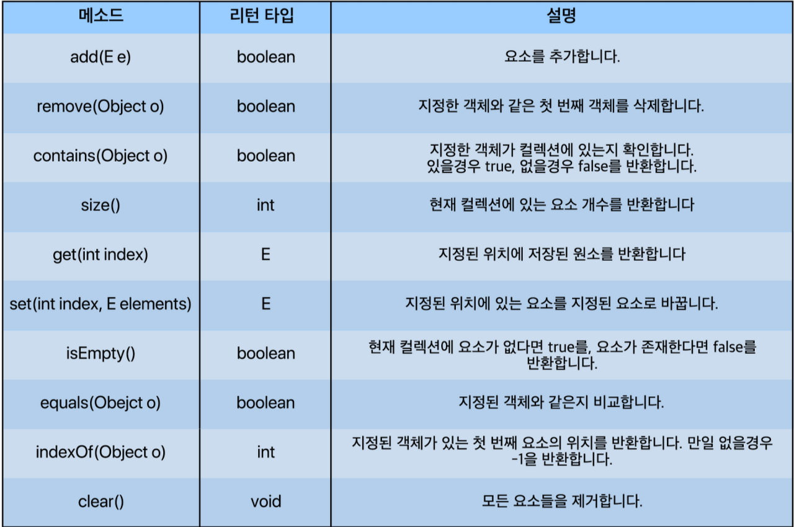

# List Interface(리스트 인터페이스)
List Interface(리스트 인터페이스)는 대표적인 선형 자료구조로 주로 순서가 있는 데이터를 목록으로 이용할 수 있도록 만들어진 인터페이스다.
배열의 기능과 동적크기 할당 기능이 합쳐진 것

<List Interface를 구현하는 클래스>
1. ArrayList
2. LinkedList
3. Vector (+ Vector를 상속받은 Stack)



<br><br>

### ArrayList
***
ArrayList는 Object[] 배열을 사용하면서 내부 구현을 통해 동적으로 관리를 한다. 우리가 흔히 쓰는 primitive 배열(ex int[])과 유사한 형태라고 보면 된다. 즉, 최상위 타입인 Object 타입으로 배열을 생성하여 사용하기 때문에 요소 접근(access elements)에서는 탁월한 성능을 보이나, 중간의 요소가 삽입, 삭제가 일어나는 경우 그 뒤의 요소들은 한 칸씩 밀어야 하거나 당겨야 하기 때문에 삽입, 삭제에서는 비효율적인 모습을 보인다.

<br><br><br>

### LinkedList
***
LinkedList는 데이터(item)와 주소로 이루어진 클래스를 만들어 서로 연결하는 방식이다. 데이터와 주소로 이루어진 클래스를 Node(노드)라고 하는데, 각 노드는 이전의 노드와 다음 노드를 연결하는 방식인 것이다.(이중 연결 리스트라고도 한다.) 즉, 객체끼리 연결한 방식이다. 이렇다보니 요소를 검색해야 할 경우 처음 노드부터 찾으려는 노드가 나올 때 까지 연결된 노드들을 모두 방문해야한다는 점에서 성능이 떨어지나, 해당 노드를 삭제, 삽입해야 할 경우 해당 노드의 링크를 끊거나 연결만 해주면 되기 때문에 삽입, 삭제에서는 매우 좋은 효율을 보인다.

<br><br><br>
### Vector
***
Vector는 자바를 배울 때 그리 자주 보이지는 않는 클래스인데, 기본적으로 ArrayList와 거의 같다고 보면 된다. Object[] 배열을 사용하며 요소 접근에서 빠른 성능을 보인다. 근데 왜 Vector가 있는 것이냐?라고 한다면, 원래 Vector는 Collection Framwork가 도입되기 전부터 지원하던 클래스였다. 그리고 Vector의 경우 항상 '동기화'를 지원한다. (쉽게 말하면 여러 쓰레드가 동시에 데이터에 접근하려하면 순차적으로 처리하도록 한다.) 그렇다보니 멀티 쓰레드에서는 안전하지만, 단일 쓰레드에서도 동기화를 하기 때문에 ArrayList에 비해 성능이 약간 느리다.
 <br><br><br>
### Stack
***
Stack은 우리가 흔히 생각하는 것처럼 쌓아 올리는 것이다. 전문용어로 말하면 LIFO(Last in First out) 또는 후입선출이라고 하는데, 쉽게 생각하면 우리가 짐을 쌓는다고 생각하면 쉽다. 짐을 쌓아올릴 때 가장 마지막에 쌓은 짐이 가장 위에 있을 것이다. 그리고 짐을 뺄 때도 가장 위에 있는 짐부터 빼게 될 것이다. 가장 대표적인 예시로는 웹페이지 '뒤로가기'가 있다. 우리가 새로운 페이지로 넘어갈 때마다 넘어가기 전 페이지를 스텍에 쌓고, 만약 뒤로가기를 누른다면 가장 위에 있는 페이지부터 꺼내오는 방식이다.
 <br><br><br>

각 객체 선언방법
``` java
/* 
T는 객체 타입을 의미하며 기본적으로
Integer, String, Double, Long 같은 Wrapper Class부터
사용자 정의 객체까지 가능하다.
ex) LinkedList<Integer> list = new LinkedList<>();
primitive type은 불가능하다.
*/

// 방법1
ArrayList<T> arraylist = new ArrayList<>();
LinkedList<T> linkedlist = new LinkedList<>();
Vector<T> vector = new Vector<>();
Stack<T> stack = new Stack<>();
 
// 방법 2
List<T> arraylist = new ArrayList<>();
List<T> linkedlist = new LinkedList<>();
List<T> vector = new Vector<>();
List<T> stack = new Stack<>();
````


출처 : https://st-lab.tistory.com/142#recentComments
