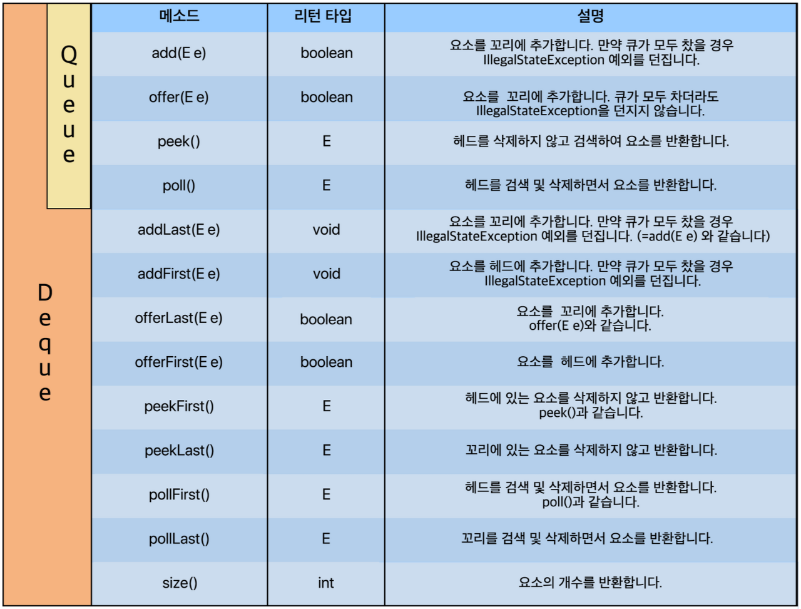

# Queue Interface

### Queue
***
선형 자료구조로 주로 순서가 있는 데이터를 기반으로 '=선입선출(FIFO, First-in First-out)을 위해 만들어진 인터페이스다.

큐에 대해 간단하게 말하자면 10, 20, 30, 40 순으로 데이터를 넣고, 데이터를 꺼낼 때(poll) 넣은 순서 그대로 10, 20, 30, 40이 나오는 구조라는 것이다. 이 때 가장 앞쪽에 있는 위치를 head(헤드)라고 부르고, 가장 후위(뒤)에 있는 위치를 tail(꼬리)라고 부른다. 
<br><br><br>
### Dequeue
***
Queue를 상속하고 있는 Deque(덱) 이라는 Interface도 있다. 둘 다 같은 부류인데 Queue는 한쪽 방향으로만(단방향) 삽입 삭제가 가능한 반면, Deque는 Double ended Queue라는 의미로 양쪽에서 삽입삭제가 가능한 자료구조라 보면 된다. 즉, head에서도 접근 가능하며, tail에서도 접근 가능한 양방향 큐라고 보면 된다.
<br><br><br>
### Queue/Deque Interface를 구현하는 클래스
***

1. LinkedList
2. ArrayDeque
3. PriorityQueue




``` java
ArrayDeque<T> arraydeque = new ArrayDeque<>();
PriorityQueue<T> priorityqueue = new PriorityQueue<>();
 
Deque<T> arraydeque = new ArrayDeque<>();
Deque<T> linkedlistdeque = new LinkedList<>();
 
Queue<T> arraydeque = new ArrayDeque<>();
Queue<T> linkedlistdeque = new LinkedList<>();
Queue<T> priorityqueue = new PriorityQueue<>();
```

출처 : https://st-lab.tistory.com/142#recentComments
